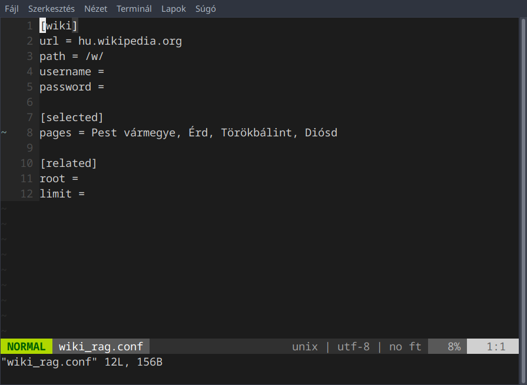
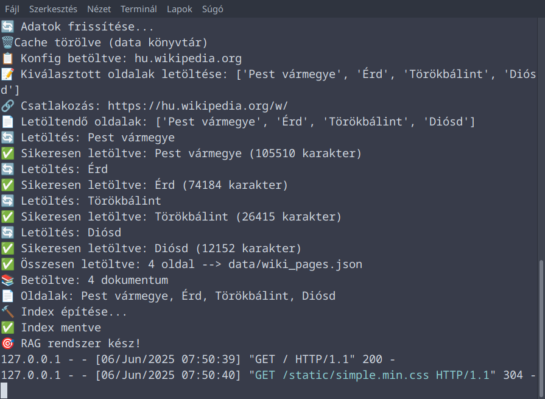
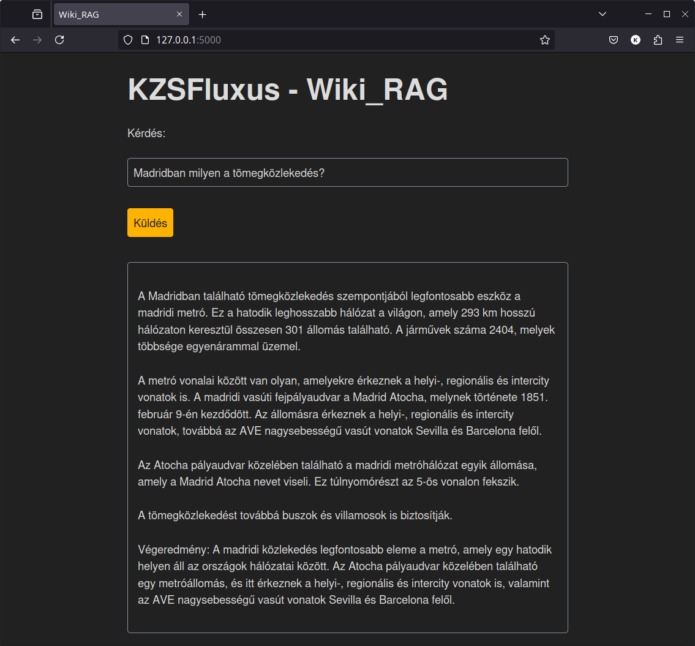

# WikiRAG 🔍📚

Retrieval-Augmented Generation rendszer MediaWiki-oldalak feldolgozásához, lokális LLM (Mistral via Ollama), FAISS indexelés és Flask-alapú keresőfelület segítségével.

## ✨ Főbb jellemzők

- 🕸️ MediaWiki-oldalak lekérdezése `mwclient` használatával
- 🧠 Embedding generálás lokálisan futó Mistral modellel (Ollama)
- ⚡ FAISS-alapú keresés
- 🌐 Flask-alapú webes keresőfelület 

---

## 🧰 Követelmények

- Python 3.10+
- [Ollama](https://ollama.com/) (telepített és futó `mistral` modell)
- `venv` (vagy `virtualenv`) a környezet izolálásához


## Telepítés:
```bash
python3 -m venv .venv
pip3 install -r requirements.txt
```

## Használat:

CLI:
```bash
source .venv/bin/activate
python3 main.py
```

WEB:
```bash
source .venv/bin/activate
python3 app.py
```

## Konfiguráció

wiki_rag.conf

```conf
[wiki]
url = hu.wikipedia.org  # A mediawiki url-je
path = /w/              # Prefix, többnyire /w/ vagy /wiki/
username =              # Felhasználónév, amennyiben szükséges
password =              # Jelszó

[selected]
pages = Pest vármegye   # Letöltendő oldal(ak)

[related]
root = Budapest         # További Budapesttel kapcsolatos oldalak
limit = 50              # Letöltött oldalak maximális száma
```
## Képernyőképek



